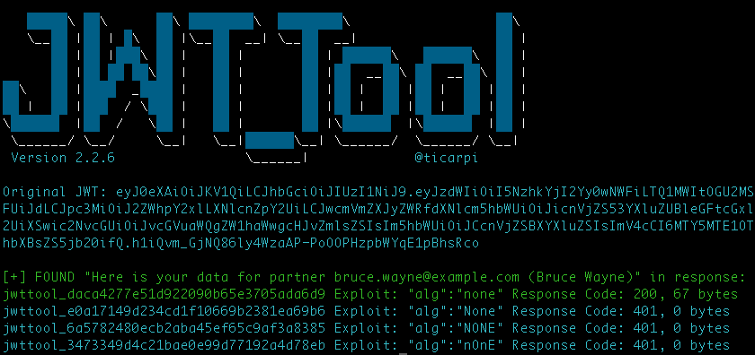

# API Security
All your APIs belong to me - API Security Demos

* [Introduction](#introduction)
* [Prerequisites]()
* [Presentation Slides](#presentation-slides)
* [Demos](#demos)
  * [Discover and Analyze APIs](#discover-and-analyze-apis)
  * [Hack APIs](#hack-apis)
    * [API1:2023 Broken Object Level Authorization](#api12023-broken-object-level-authorization)
    * [API2:2023 Broken Authentication](#api22023-broken-authentication)
    * [API3:2023 Broken Object Property Level Authorization](#api32023-broken-object-property-level-authorization)
    * [API4:2023 Unrestricted Resource Consumption](#api42023-unrestricted-resource-consumption)
    * [API5:2023 Broken Function Level Authorization](#api52023-broken-function-level-authorization)
    * [API6:2023 Unrestricted Access to Sensitive Business Flows](#api62023-unrestricted-access-to-sensitive-business-flows)
    * [API7:2023 Server Side Request Forgery](#api72023-server-side-request-forgery)
    * [API8:2023 Security Misconfiguration](#api82023-security-misconfiguration)
    * [API9:2023 Improper Inventory Management](#api92023-improper-inventory-management)
    * [API10:2023 Unsafe Consumption of APIs](#api102023-unsafe-consumption-of-apis)

## Introduction

This repository contains sample demos to show possible API security risks as listed on the [OWASP API Security Top Ten (2023)](https://owasp.org/API-Security/editions/2023/en/0x00-header/).
You can find two variants of the demo APIs (both implemented as Java applications using Spring Boot):

* insecure-api: This is the insecure one with different built-in flaws of the OWASP API Security 2023.
* secure-api: This the secure variant that shows different ways on how to defend against those kind of attacks

## Prerequisites

To try all the demos in this repository you need:

* A Java SDK, at least LTS version 17
* Any JAVA IDE you like
* Any tool to execute REST or GraphQL API calls (recommended tool is [Postman](https://www.postman.com/), but you may also use [curl](https://curl.se/) or [httpie](https://httpie.io/)) 
* Python 3.6+
* The [JWT_Tool](https://github.com/ticarpi/jwt_tool) to forge JSON Web Tokens (JWTs)
* [Locust](https://github.com/locustio/locust) for performing some load & stress testing
* The [custom spring authorization server](https://github.com/andifalk/custom-spring-authorization-server) as identity provider when you want to try the secure api application. 
* Docker and docker compose to run the `docker-compose.yml` file to spawn up a redis server (required for the rate limiter of the API gateway)

## Presentation Slides

* [Spring I/O 2023 Barcelona](presentations/spring_io_2023/All_your_APIs_are_mine_springio_2023.pdf)

## Demos

### Discover and Analyze APIs

#### Google Dorks

```
inurl:"/includes/api/" intext:"index of /"
```

```
intitle:"index of" api_key OR "api key" OR
apiKey -pool
```

#### Shodan

Just try this one on https://shodan.io

```http request
"content-type: application/json"
```

#### OWASP Amass

Try to find Twitter APIs in a _passive_ scan.

```shell
amass enum -passive -d twitter.com | grep api
```

> _Never_ perform __active__ scans on websites you do not own or are not authorized to. __Passive__ scans are not an issue.

#### API Documentation

If your API documentation is available without any restrictions then everybody (also the _bad_ guys) can grab it and for example just import these into [Postman](https://www.postman.com/) and build collections to make it easier to hack your APIs.

Try the following URLs on the _Insecure API_ project:

* [Open API 3 (/v3/api-docs)](http://localhost:9090/v3/api-docs)
* [Swagger (/swagger-ui.html)](http://localhost:9090/swagger-ui.html)
* [GraphQL Schema (/graphql/schema)](http://localhost:9090/graphql/schema)
* [GraphiQL web console (/graphiql)](http://localhost:9090/graphiql)

### Hack APIs

#### Prerequisites

Make sure you also have cloned the git repository for [custom spring authorization server](https://github.com/andifalk/custom-spring-authorization-server). Here you find the `SpringAuthorizationServerApplication` to run.

Before starting the Api Gateway you need a running redis server locally.
To do this just open a terminal in the root directory of this project an run

`docker compose up -d`

When you are finished hacking APIs make sure you stop the redis server again using

`docker compose stop`

#### Run all required applications

Before starting to hack APIs make sure you have started all the required applications:

* InsecureApiApplication (running at http://localhost:9090)
* SecureApiApplication (running at http://localhost:9091)
* PartnerWorkshopApplication (running at http://localhost:9092)
* ApiGatewayApplication (running at http://localhost:9999)
* SpringAuthorizationServerApplication (running at http://localhost:9500)

#### API1:2023 Broken Object Level Authorization

Try to access another user's vehicle, you should not have access to.

##### Step 1: The insecure way

1. Login using http://localhost:9090/api/v1/users/login
   and specify the credentials `bruce.wayne@example.com / wayne` to log in
2. Try to enumerate getting a vehicle from http://localhost:9090/api/v1/vehicles/{vehicle_id}, e.g. http://localhost:9090/api/v1/vehicles/1
3. Check if you can see vehicle data

##### Step 2: The secure way

Now try the same on the secure API.

1. Login using http://localhost:9091/api/v1/users/login is not possible anymore.
   This is replaced by an identity provider (spring authorization server). So you have to start the [custom spring authorization server](https://github.com/andifalk/custom-spring-authorization-server) and specify the credentials `bwayne / wayne` to log in using the OAuth2/OpenID Connect protocol. You can trigger this by navigating to the _Authorization_ tab of the top level folder of in the Postman collection. Use the token and store it as variable `bearer_token`.
2. Try to enumerate getting a vehicle from http://localhost:9091/api/v1/vehicles/{vehicle_id}, e.g. http://localhost:9091/api/v1/vehicles/1
3. Check again if you still can access other user's vehicle data

#### API2:2023 Broken Authentication

##### Step 1: The insecure way

First we try to forge a JWTs using several well known attack types (using the playbook mode of the JWT_Tool):

Login using http://localhost:9090/api/v1/users/login
   and specify the credentials `bruce.wayne@example.com / wayne` to log in and grab the returned JWT

```shell
export JWT=<the JWT you grabbed from step 2>
```

Now try this playbook attack with the JWT you grabbed to find any vulnerabilities at http://localhost:9090/api/v1/partner:

```shell
./jwt_tool.py -t http://localhost:9090/api/v1/partner -rh "Authorization: Bearer $JWT" -cv "Here is your data for partner bruce.wayne@example.com (Bruce Wayne)" -M pb -np
```

After performing the playbook you see which attacks seemed to be successful.
Then you might try a specific attack type separately, like the exploit specifying the `none` signature algorithm as `alg:none`:

```shell
./jwt_tool.py -t http://localhost:9090/api/v1/partner -rh "Authorization: Bearer $JWT" -cv "Here is your data for partner bruce.wayne@example.com (Bruce Wayne)" -X a -np
```

In our case this is successful:



Finally try to brute force the JWT to find out the secret for signing a JWT using the symmetric HMAC signature algorithm
 `jwt_tool.py $JWT -C -d jwt.secrets.list`

The secrets list was just grabbed from https://github.com/wallarm/jwt-secrets.

##### Step 2: The secure way

Now try the same steps using the secure API and getting the JWT from the Custom Spring Authorization Server.

```shell
export JWT=<the JWT you grabbed from the custom spring authorization server>
```

```shell
./jwt_tool.py -t http://localhost:9091/api/v1/partner -rh "Authorization: Bearer $JWT" -cv "Here is your data for partner bruce.wayne@example.com (Bruce Wayne)" -M pb -np
```

After performing the playbook you see which attacks seemed to be successful.
Then you might try a specific attack type separately, like the exploit specifying the `none` signature algorithm as `alg:none`:

```shell
./jwt_tool.py -t http://localhost:9091/api/v1/partner -rh "Authorization: Bearer $JWT" -cv "Here is your data for partner bruce.wayne@example.com (Bruce Wayne)" -X a -np
```

This should not have any success now.

Finally try to brute force the JWT to find out the secret for signing a JWT using the symmetric HMAC signature algorithm
`jwt_tool.py $JWT -C -d jwt.secrets.list`

Breaking this kind of JWT should also not be possible anymore as it will tell you that no HMAC key is used for signing the JWT.

#### API3:2023 Broken Object Property Level Authorization

##### Step 1: The insecure way

Try to get some sensitive data exposed.

1. Login using http://localhost:9090/api/v1/users/login
   and specify the credentials `bruce.wayne@example.com / wayne` to log in
2. Try to enumerate getting a vehicle from http://localhost:9090/api/v1/community

##### Step 2: The secure way

1. Login using Custom Spring Authorization Server
   and specify the credentials `bwayne / wayne` to log in
2. Try to enumerate getting a vehicle from http://localhost:9091/api/v1/community

You will recognize it is much more difficult to enumerate different ids for vehicles as ids have to be a UUID now.

To make it easier to verify the authorization you could try these vehicle ids:

* Vehicle of Bruce Wayne: ed6d9c4a-ac3f-4060-9d7c-9cdbfe82b0ea
* Vehicle of Peter Parker: 2d20c657-c3d5-434e-ac5c-dcac711c73aa
* Vehicle of Clark Kent: 957e7f95-5876-435e-8aa6-936e566fa2c3

#### API4:2023 Unrestricted Resource Consumption

##### Step 1: Try to cause a Denial of Service attack

Try a Denial of Service attack.

1. Login using http://localhost:9090/api/v1/users/login
   and specify the credentials `bruce.wayne@example.com / wayne` to log in
2. Try to flood http://localhost:9090/api/v1/community with requests

For this use the rate limit client with the JWT from login.

You could also use [Locust](https://github.com/locustio/locust) for this.
If you already have installed python3 then you just have to perform a `pip install locust` to install locust.

Then use the provided file `locustfile.py` and run `locust -f locustfile.py`
In the [Locust web UI](http://0.0.0.0:8089/) specify the target server http://localhost:9090 of the backend service.

##### Step 2: Use the Rate Limiter of the API Gateway

1. Login using Custom Spring Authorization Server
   and specify the credentials `bwayne / wayne` to log in
2. Try to flood http://localhost:9091/api/v1/community with requests

For this use the rate limit client with the JWT from the Custom Spring Authorization Server.

You could also use [Locust](https://github.com/locustio/locust) for this.
If you already have installed python3 then you just have to perform a `pip install locust` to install locust.

Then use the provided file `locustfile.py` and run `locust -f locustfile.py`
In the [Locust web UI](http://0.0.0.0:8089/) specify the target server http://localhost:9999 using the API Gateway with the rate limiting functionality).

#### API5:2023 Broken Function Level Authorization

There is an administrative GET request endpoint located at http://localhost:9090/api/v1/vehicles that returns all registered vehicles for all users. This is a broken function level authorization.

You should check for the administrative role before allowing such request. Now try the same on the secure API using the GET request located at http://localhost:9091/api/v1/vehicles

You may try the same with the GraphQL endpoint be posting this body to the GraphQL endpoint (http://localhost:9090/graphql for the insecure API or http://localhost:9091/graphql for the secure API).

```graphql
{
    vehicles {
        identifier
        manufacturer
        model
        owner
        vin
    }
}
```

#### API6:2023 Unrestricted Access to Sensitive Business Flows

Further demos and hacks are being added soon...stay tuned!

#### API7:2023 Server Side Request Forgery

There is an endpoint located at `/api/v1/vehicles/1/contact-workshop` that expects the following body:

```json
{
    "problem": "Electronic does have problems",
    "partnerApi": "http://localhost:9092/api/workshop"
}
```

##### Step 1: The insecure way

Try to call this endpoint at `http://localhost:9090/api/v1/vehicles/1/contact-workshop` with this special body instead:

```json
{
    "problem": "Electronic does have problems",
    "partnerApi": "https://heise.de"
}
```

You will notice that you can just specify any URL here. There is no validation at all. This is called SSRF.

##### Step 2: The secure way

Now try to call this endpoint at `http://localhost:9091/api/v1/vehicles/1/contact-workshop` with the same special body:

```json
{
    "problem": "Electronic does have problems",
    "partnerApi": "https://heise.de"
}
```

#### API8:2023 Security Misconfiguration

Further demos and hacks are being added soon...stay tuned!

#### API9:2023 Improper Inventory Management

Further demos and hacks are being added soon...stay tuned!

#### API10:2023 Unsafe Consumption of APIs

Again we want to contact the workshop using `http://localhost:9090/api/v1/vehicles/1/contact-workshop` with the valid body:

```json
{
    "problem": "Electronic does have problems",
    "partnerApi": "http://localhost:9092/api/workshop"
}
```

Let's examine the response:

```html
</img>
```

It seems that this workshop API is compromised. So if you would render this response directly in you web browser 
you will get a XSS attack.
So, if you call this API as part of your own APIs always make sure to also validate the response first before using 
the data that was returned.
